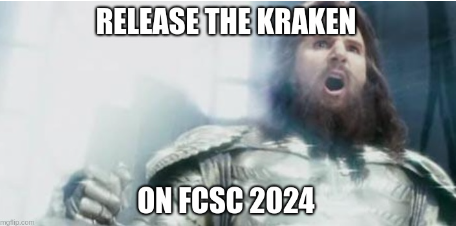

# FCSC 2024 Kraken

Un ami à vous se méfie des mots de passe classiques et des primitives cryptographiques usuelles utilisées pour les valider. Bon développeur, il a codé à ses heures perdues un système personnalisé de validation de “mots de passe” (en quelque sorte …). Il vous affirme que son système exotique est inviolable et vous met au défi de retrouver ses credentials depuis son binaire d’authentification qu’il utilise sur son propre serveur. Pourrez-vous lui prouver que son système est faillible ?

Fichiers :
- [Dockerfile.kraken](Dockerfile.kraken)
- [kraken](kraken)
- [Makefile](Makefile)
- [README_FCSC.md](README_FCSC.md)

Auteur : rbe

Origine : [Kraken](https://hackropole.fr/fr/challenges/reverse/fcsc2024-reverse-kraken/)

-----------

## Connectez vous 
> http://localhost

-----------

## Installation manuel
Vous n'utilisez pas l'application **les CTFs de Cyrhades** ? C'est dommage !
Mais voici comment installer ce CTF manuellement :

> git clone https://github.com/Hack-Oeil/fcsc2024-reverse-kraken.git

> cd fcsc2024-reverse-kraken

-----------

## Sur le site officiel hackropole.fr
> https://hackropole.fr/fr/challenges/reverse/fcsc2024-reverse-kraken/